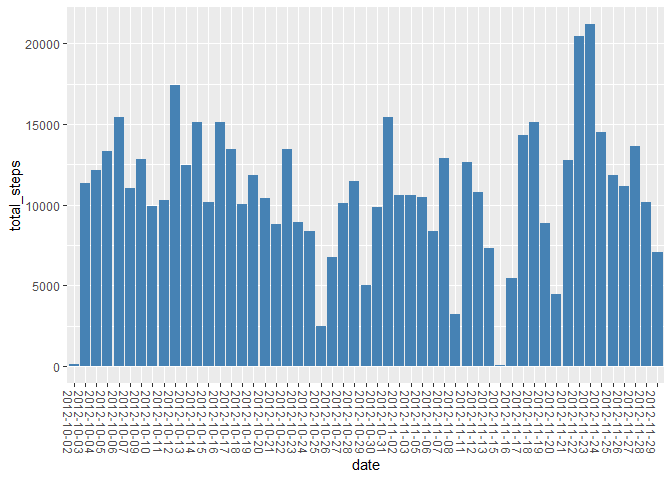
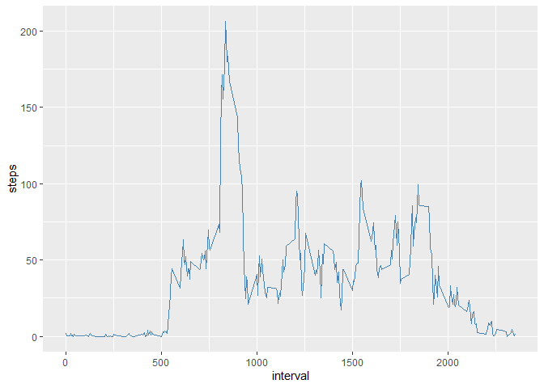
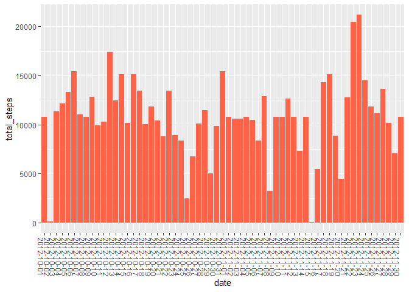
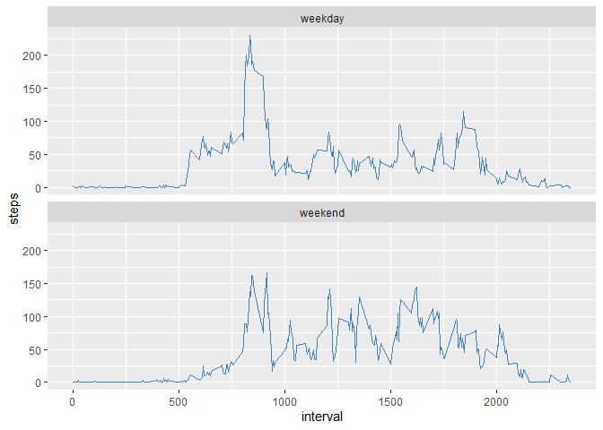

## Loading and preprocessing the data

```r
library(tidyverse)
```

```
## -- Attaching packages --------------------------------------- tidyverse 1.3.1 --
```

```
## v ggplot2 3.3.5     v purrr   0.3.4
## v tibble  3.1.2     v dplyr   1.0.7
## v tidyr   1.1.3     v stringr 1.4.0
## v readr   1.4.0     v forcats 0.5.1
```

```
## -- Conflicts ------------------------------------------ tidyverse_conflicts() --
## x dplyr::filter() masks stats::filter()
## x dplyr::lag()    masks stats::lag()
```

```r
rawdata <- read.table(unz("activity.zip", "activity.csv"), header=TRUE, quote="\"", sep=",")

#remove NA
stepdata <- rawdata[!is.na(rawdata$steps),]
```


## What is mean total number of steps taken per day?  
1. Make a histogram of the total number of steps taken each day  

```r
daily_steps <- stepdata %>% 
  group_by(date) %>% 
  summarise(total_steps = sum(steps))

ggplot(data = daily_steps, mapping = aes(y=total_steps, x=date)) +
  geom_col(fill="steelblue") +
  theme(axis.text.x=element_text(angle = -90, hjust = 0)) ## rotate the x labels
```

<!-- -->
2. Calculate and report the mean and median total number of steps taken per day


```r
mean_daily_steps <- mean(daily_steps$total_steps)
median_daily_steps <- median(daily_steps$total_steps)

print(paste("Mean daily steps:", round(mean_daily_steps,1)))
```

```
## [1] "Mean daily steps: 10766.2"
```

```r
print(paste("Median daily steps:", median_daily_steps))
```

```
## [1] "Median daily steps: 10765"
```
## What is the average daily activity pattern?
1. Make a time series plot of the 5-minute interval (x-axis) and the average number of steps taken, averaged across all days (y-axis)  


```r
daily_pattern <- stepdata %>% 
  group_by(interval) %>% 
  summarise(steps = mean(steps))

#with(daily_pattern, plot(x=interval, y=steps, type = "l"))

ggplot(data = daily_pattern, mapping=aes(x=interval, y=steps)) +
  geom_line(color="steelblue")
```

<!-- -->
  
2. Which 5-minute interval, on average across all the days in the dataset, contains the maximum number of steps?  

```r
max_step <- max(daily_pattern$steps)
max_interval <- daily_pattern[daily_pattern$steps == max_step, 1]

print(paste("Max average steps of", round(max_step,1), "happens at interval", max_interval))
```

```
## [1] "Max average steps of 206.2 happens at interval 835"
```

## Imputing missing values
1. Calculate and report the total number of missing values in the dataset  

```r
#count NA rows

NA_rows <- sum(is.na(rawdata$steps))
print(paste("There are", NA_rows, "missing rows in the dataset."))
```

```
## [1] "There are 2304 missing rows in the dataset."
```
2. Devise a strategy for filling in all of the missing values in the dataset.  
  
Use the mean interval steps (from daily_pattern) to impute missing values into filldata.  

3. Create a new dataset that is equal to the original dataset but with the missing data filled in.

```r
filldata <- rawdata

for (i in c(1:nrow(filldata))){
    if(is.na(filldata[i,1])){
      interval <- filldata[i,3]
      filldata[i,1] <- daily_pattern[daily_pattern$interval==interval,2]
    }
}

filldata_summary <- filldata %>% 
  group_by(date) %>% 
  summarise(total_steps = sum(steps))

ggplot(data = filldata_summary, mapping = aes(y=total_steps, x=date)) +
  geom_col(fill="tomato") +
  theme(axis.text.x=element_text(angle = -90, hjust = 0)) ## rotate the x labels
```

<!-- -->

4. Make a histogram of the total number of steps taken each day and Calculate and report the mean and median total number of steps taken per day. Do these values differ from the estimates from the first part of the assignment? What is the impact of imputing missing data on the estimates of the total daily number of steps?  


```r
filled_mean_daily_steps <- mean(filldata_summary$total_steps)
filled_median_daily_steps <- median(filldata_summary$total_steps)
print(paste("Mean daily steps:", round(mean_daily_steps,1)))
```

```
## [1] "Mean daily steps: 10766.2"
```

```r
print(paste("Median daily steps:", median_daily_steps))
```

```
## [1] "Median daily steps: 10765"
```

```r
print(paste("Mean daily steps of imputed data:", round(filled_mean_daily_steps,1)))
```

```
## [1] "Mean daily steps of imputed data: 10766.2"
```

```r
print(paste("Median daily steps of imputed data:", round(filled_median_daily_steps,1)))
```

```
## [1] "Median daily steps of imputed data: 10766.2"
```
The mean and median values have changed slightly. By imputing the missing data with mean values, the median has slightly increased from 10765 to 10766.2.  The mean remains the same.


## Are there differences in activity patterns between weekdays and weekends?
1. Create a new factor variable in the dataset with two levels -- "weekday" and "weekend" indicating whether a given date is a weekday or weekend day.

```r
filldata <- filldata %>% 
  mutate(date = as.Date(date,"%Y-%m-%d")) %>% 
  mutate(daytype = case_when(
    weekdays(date, abbreviate=TRUE) %in% c("Sat","Sun") ~ "weekend", 
    weekdays(date, abbreviate=TRUE) %in% c("Mon","Tue","Wed","Thu","Fri") ~ "weekday")
    ) 

#convert to factor
filldata[,4] <- as.factor(filldata[,4])
```

2. Make a panel plot containing a time series plot (i.e. type = "l") of the 5-minute interval (x-axis) and the average number of steps taken, averaged across all weekday days or weekend days (y-axis). 


```r
fill_daily_pattern <- filldata %>% 
  group_by(interval,daytype) %>% 
  summarise(steps = mean(steps))
```

```
## `summarise()` has grouped output by 'interval'. You can override using the `.groups` argument.
```

```r
ggplot(data = fill_daily_pattern, mapping = aes(x=interval, y=steps)) + 
  geom_line(color = "steelblue") +
  facet_wrap(~daytype, nrow=2)
```

<!-- -->

During the weekend, people wake up later (no sharp rise at 5:30) and walk less during the morning peak (8AM - 9AM). However, they stay more active during the day.  
